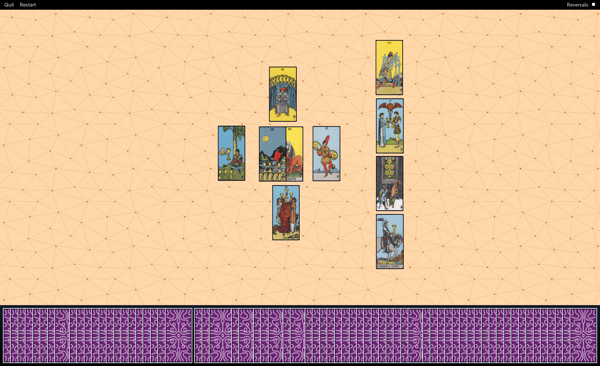

# Tarot

Although most often used for divination, the Rider-Waite-Smith tarot
is often used as a tool for shifting your perspective on a situation:

> But as both a spiritual and spiritually-skeptical person, I’ve found that
> tarot cards are a gateway to genuine self-reflection. From my
> secular-and-somewhat-cynical perspective of life, I consider tarot a tool
> for learning how to interrogate the false narratives that dictate your perception of self.

> The random combinations of cards invite us to reconsider our own narratives
> according to a completely random perspective.

_Elica Starr ([Source](https://medium.com/@elicastarr/why-you-should-believe-your-tarot-cards-2ce14b199eb8))_

## Motivation

Even though a physical deck is better, I chose this little project as a means of
trying out [tauri](https://tauri.app/).

